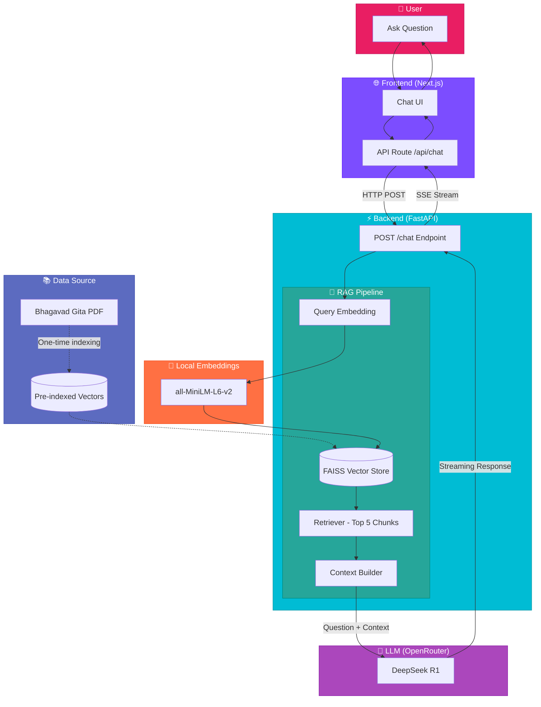

# GeetaGPT: Spiritual Guidance through AI 🕉️

GeetaGPT is a high-performance **Retrieval-Augmented Generation (RAG)** application designed to provide spiritual wisdom and guidance based strictly on the **Bhagavad Gita**. It leverages state-of-the-art AI models to ensure that every answer is grounded in the sacred text.

---

## 🎬 Demo


*Ask spiritual questions and receive wisdom grounded in the Bhagavad Gita with real-time streaming responses.*

---

## 🏗️ Architecture & How It Works

GeetaGPT follows a classic RAG architecture, ensuring that the AI doesn't "hallucinate" but instead retrieves relevant verses from the Gita before generating a response.

### High-Level Design (HLD)



### Data Flow

| Step | Component | Action |
|------|-----------|--------|
| 1️⃣ | **User** | Asks a spiritual question |
| 2️⃣ | **Next.js UI** | Sends request to API route |
| 3️⃣ | **API Route** | Proxies to FastAPI backend |
| 4️⃣ | **FastAPI** | Embeds query using local model |
| 5️⃣ | **FAISS** | Retrieves 5 most similar chunks |
| 6️⃣ | **RAG Chain** | Builds context from chunks |
| 7️⃣ | **DeepSeek R1** | Generates grounded response |
| 8️⃣ | **Streaming** | Response streams back to user |

### 1. The RAG Pipeline (Backend)
The backend is built with **FastAPI** and **LangChain**. Here's the step-by-step data flow:

1.  **Document Ingestion**: The system reads the `bhagavad_gita.pdf` from the `backend/app/data/` directory.
2.  **Text Chunking**: The text is broken down into smaller, overlapping segments (chunks) to preserve context.
3.  **Vector Embeddings**: Each chunk is converted into a numerical vector using the `all-MiniLM-L6-v2` model. This allows for semantic searching.
4.  **Vector Storage (FAISS)**: The vectors are stored in a local **FAISS** index for lightning-fast retrieval.
5.  **Retrieval**: When you ask a question, the system finds the 5 most relevant chunks from the Gita.
6.  **Augmented Generation**: The question + retrieved chunks are sent to the **DeepSeek R1** model (via OpenRouter) with a strict instruction: *"Only answer using the provided context."*
7.  **Streaming**: The response is streamed back to the user in real-time.

### 2. The Interactive UI (Frontend)
The frontend is built with **Next.js 15+** and **Tailwind CSS**.

- **Modern UX**: Uses **Framer Motion** for smooth animations and transitions.
- **Real-time Streaming**: Implements chunk-by-chunk rendering for a snappy, conversational feel.
- **Glassmorphism Design**: A premium, spiritual aesthetic with soft gradients and blurred backgrounds.
- **API Proxy**: The Next.js API routes act as a secure bridge to the FastAPI backend.

---

## 🛠️ Tech Stack

### Backend
- **Framework**: FastAPI (Python)
- **Orchestration**: LangChain
- **Vector DB**: FAISS
- **Embeddings**: Sentence-Transformers (`all-MiniLM-L6-v2`)
- **LLM Engine**: DeepSeek R1 via OpenRouter

### Frontend
- **Framework**: Next.js (App Router, TypeScript)
- **Animations**: Framer Motion
- **Icons**: Lucide React
- **Styling**: Tailwind CSS 4.0

---

## 🚀 Getting Started

### Prerequisites
- Python 3.10+
- Node.js 18+
- An OpenRouter API Key

### 1. Setup Backend
```bash
cd backend
python -m venv venv
source venv/bin/activate  # On Windows: venv\Scripts\activate
pip install -r requirements.txt
```

**Environment Variables**: Create a `.env` file in `backend/` or set them in your shell:
```env
OPENROUTER_API_KEY=your_key_here
PDF_PATH=./app/data/bhagavad_gita.pdf
VECTOR_DB_PATH=faiss_index
LLM_MODEL=tngtech/deepseek-r1t2-chimera:free
```

**Run Server**:
```bash
uvicorn app.main:app --reload --port 8000
```

### 2. Setup Frontend
```bash
cd frontend
npm install
npm run dev
```
Open [http://localhost:3000](http://localhost:3000) to start your journey.

---

## ✨ Features
- **Strict Grounding**: Only answers based on the Bhagavad Gita text.
- **Source Attributions**: Provides verse references for every answer.
- **Persistent Index**: The PDF is indexed only once; subsequent starts are nearly instant.
- **Mobile Responsive**: Fully optimized for phones and tablets.
- **Premium Design**: Spiritual vibes with high-end animations.

---

## 📜 License
This project is for educational and spiritual exploration. The wisdom contained is eternal.
