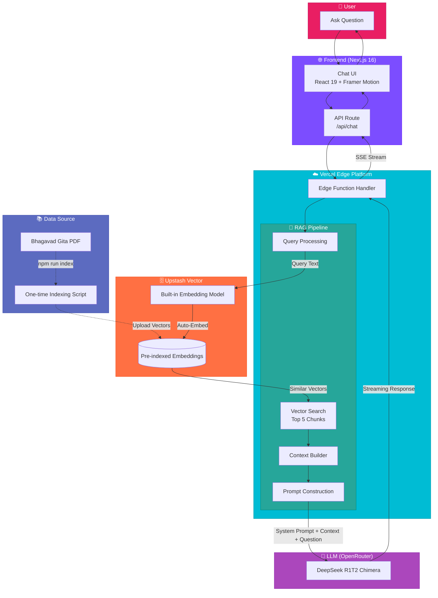

# GeetaGPT: Spiritual Guidance through AI 🕉️

[](https://geetagpt-silk.vercel.app)

GeetaGPT is a high-performance **Retrieval-Augmented Generation (RAG)** application designed to provide spiritual wisdom and guidance based strictly on the **Bhagavad Gita**. It leverages state-of-the-art AI models to ensure that every answer is grounded in the sacred text.

**🚀 Try it now: [geetagpt-silk.vercel.app](https://geetagpt-silk.vercel.app)**

---

## ️ Architecture & How It Works

GeetaGPT is a **serverless RAG (Retrieval-Augmented Generation)** application deployed on **Vercel**. It uses **Upstash Vector** for cloud-native vector storage and ensures grounded AI responses based strictly on the Bhagavad Gita.

### High-Level Design (HLD)



### Data Flow

| Step | Component | Action |
|------|-----------|--------|
| 1️⃣ | **User** | Asks a spiritual question via the chat UI |
| 2️⃣ | **Next.js Frontend** | Sends POST request to `/api/chat` |
| 3️⃣ | **Vercel Edge Function** | Receives request and processes query |
| 4️⃣ | **Upstash Vector** | Auto-embeds query and searches for top 5 similar chunks |
| 5️⃣ | **Context Builder** | Combines retrieved chunks into context |
| 6️⃣ | **Prompt Construction** | Creates system prompt with context + user question |
| 7️⃣ | **OpenRouter (DeepSeek R1)** | Generates grounded response based on context |
| 8️⃣ | **Streaming Response** | Streams answer back to user in real-time |

### 1. The Serverless RAG Pipeline
The entire RAG pipeline is implemented as a **Vercel Edge Function** in the Next.js API route. Here's how it works:

1.  **Query Reception**: User sends a question via the chat UI (`/api/chat` API route).
2.  **Automatic Embedding**: Upstash Vector automatically generates embeddings for the query using its built-in model (no manual embedding needed).
3.  **Vector Search**: Upstash searches the pre-indexed vector database and returns the top 5 most semantically similar chunks from the Bhagavad Gita.
4.  **Context Assembly**: Retrieved chunks are concatenated with separators to form the context.
5.  **Prompt Engineering**: A strict system prompt is constructed:
    ```
    You are GeetaGPT. Answer ONLY using the provided context from the Bhagavad Gita.
    If the answer is not in the context, say: "The Bhagavad Gita does not explicitly address this."
    ```
6.  **LLM Generation**: The prompt + context + user question is sent to **DeepSeek R1T2 Chimera** via OpenRouter API.
7.  **Streaming Response**: The LLM response is streamed back token-by-token for a real-time conversational experience.

**Key Technologies:**
- **Upstash Vector**: Serverless vector database with built-in embeddings
- **OpenRouter**: LLM gateway for accessing DeepSeek R1
- **Vercel Edge Functions**: Zero-config serverless deployment

### 2. The Interactive UI (Frontend)
The frontend is built with **Next.js 16** (App Router) and **React 19**:

- **Modern UX**: Uses **Framer Motion** for smooth page transitions and micro-animations
- **Real-time Streaming**: Implements token-by-token rendering for instant feedback
- **Responsive Design**: Fully optimized for mobile, tablet, and desktop
- **Glassmorphism Aesthetic**: Premium spiritual design with soft gradients and blurred backgrounds
- **Tailwind CSS 4.0**: Utility-first styling with custom color palette

### 3. One-Time Indexing Process
Before deployment, the Bhagavad Gita PDF is indexed once:

1.  **PDF Parsing**: Extract text from `bhagavad_gita.pdf`
2.  **Text Chunking**: Split into overlapping chunks (preserves context)
3.  **Upload to Upstash**: Send chunks to Upstash Vector (embeddings generated automatically)
4.  **Ready to Use**: Vector database is now queryable from the Edge Function

**Command**: `npm run index` (in `frontend/scripts/index-pdf.ts`)

---

## 🛠️ Tech Stack

### Frontend (Next.js Serverless)
- **Framework**: Next.js 16 (App Router)
- **Language**: TypeScript
- **UI Library**: React 19
- **Styling**: Tailwind CSS 4.0
- **Animations**: Framer Motion
- **Icons**: Lucide React
- **HTTP Client**: OpenAI SDK (for OpenRouter integration)

### Backend (Serverless)
- **Deployment**: Vercel Edge Functions
- **Vector Database**: Upstash Vector (serverless, built-in embeddings)
- **LLM Engine**: DeepSeek R1T2 Chimera via OpenRouter
- **Indexing Script**: Node.js + TypeScript (`tsx`)

### Infrastructure
- **Hosting**: Vercel (Frontend + Edge Functions)
- **Vector Storage**: Upstash (Serverless Vector Database)
- **LLM Gateway**: OpenRouter (API access to DeepSeek R1)

---

## 🚀 Getting Started

### Prerequisites
- Node.js 18+
- An OpenRouter API Key ([Get one here](https://openrouter.ai/))
- An Upstash Vector Database ([Create free account](https://upstash.com/))

### 1. Clone the Repository
```bash
git clone https://github.com/ravisharma46/GeetaGPT.git
cd GeetaGPT/frontend
```

### 2. Install Dependencies
```bash
npm install
```

### 3. Configure Environment Variables
Create a `.env.local` file in the `frontend/` directory:

```env
# OpenRouter API Key
OPENROUTER_API_KEY=your_openrouter_api_key_here

# Upstash Vector Database
UPSTASH_VECTOR_REST_URL=https://your-endpoint.upstash.io
UPSTASH_VECTOR_REST_TOKEN=your_upstash_token_here
```

**Where to get these:**
- **OpenRouter API Key**: Sign up at [openrouter.ai](https://openrouter.ai/) and create an API key
- **Upstash Credentials**: 
  1. Create a free account at [upstash.com](https://upstash.com/)
  2. Create a new Vector Database
  3. Copy the `REST URL` and `REST TOKEN` from the database dashboard

### 4. Index the Bhagavad Gita (One-Time Setup)
Place your `bhagavad_gita.pdf` in the `frontend/` directory, then run:

```bash
npm run index
```

This script will:
- Parse the PDF
- Split it into semantic chunks
- Upload chunks to Upstash Vector (embeddings are generated automatically)

**Note**: You only need to run this once. The vectors persist in Upstash cloud.

### 5. Run the Development Server
```bash
npm run dev
```

Open [http://localhost:3000](http://localhost:3000) to start your spiritual journey.

### 6. Deploy to Vercel (Optional)
The app is fully serverless and ready to deploy:

```bash
npm install -g vercel
vercel
```

Or connect your GitHub repository to Vercel for automatic deployments.

**Important**: Make sure to add your environment variables in the Vercel dashboard under Project Settings → Environment Variables.

---

## ✨ Features

- ✅ **100% Grounded Responses**: Only answers based on the Bhagavad Gita text, no hallucinations
- ✅ **Serverless Architecture**: Deploy globally with zero server management
- ✅ **Cloud-Native Vector DB**: Upstash Vector for ultra-fast semantic search
- ✅ **Real-Time Streaming**: Token-by-token response rendering for instant feedback
- ✅ **Automatic Embeddings**: No manual embedding pipeline, Upstash handles it automatically
- ✅ **Source Citations**: Provides chapter and verse references when available
- ✅ **Mobile Responsive**: Fully optimized for phones, tablets, and desktops
- ✅ **Premium UI/UX**: Spiritual aesthetic with glassmorphism and smooth animations
- ✅ **One-Click Deployment**: Ready to deploy to Vercel in seconds
- ✅ **Free Tier Ready**: Works with Upstash and OpenRouter free tiers

---

## 📜 License
This project is for educational and spiritual exploration. The wisdom contained is eternal.
